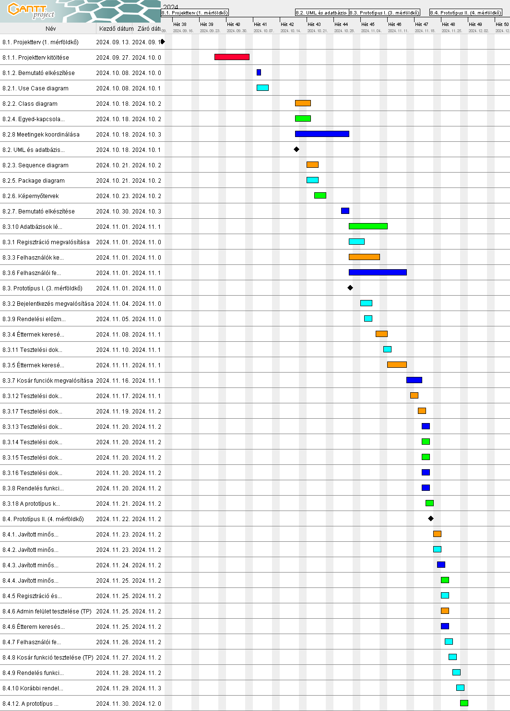

# Étel Projektterv 2024

## 1. Összefoglaló

Az ételszállítás lényege, hogy az ételek a lehető legkisebb költséggel, legbiztonságosabban, és legoptimálisabb időben jussanak el a rendeltetési helyükre. Ez tipikusan megkövetel egy online is elérhető nyilvántartást, ahol rugalmasan és egyszerűen lehet kezelni a kapcsolódó feladatokat. Éppen ezért ennek a projektnek a célja, hogy a futárcégek számára egy webalkalmazást fejlesszünk, amely képes leváltani a hagyományos, papír alapú nyilvántartásokat. Legyen szó ételkészletről, futárokról vagy útvonalakról, a cél, hogy a kapcsolódó funkciókat egy letisztult felületen keresztül tudja elérni a futárcég.

## 2. A projekt bemutatása

Ez a projektterv az Étel projektet mutatja be, amely 2024-09-13-tól 2024-12-06-ig tart, azaz összesen 84 napon keresztül fog futni. A projekten négy fejlesztő fog dolgozni, az elvégzett feladatokat pedig négy alkalommal fogjuk prezentálni a megrendelőnek, annak érdekében, hogy biztosítsuk a projekt folyamatos előrehaladását.

### 2.1. Rendszerspecifikáció

A rendszernek képesnek kell lennie arra, hogy egy adott ételszállító cég éttermeit és azok kínálatát (ételek, elérhetőség, speciális tulajdonságok pl. vegetáriánus vagy gluténmentes) nyilvántartsa annak érdekében, hogy a felhasználók könnyedén böngészhessenek és szűrhessenek az éttermek és ételek között. Ezenkívül a felhasználóknak lehetőséget kell biztosítani rendelés leadására, valamint a korábbi rendeléseik visszanézésére. Minden funkció a megfelelő felhasználói jogosultság mellett használható, annak függvényében írható, olvasható vagy nem megtekinthető az adat.

### 2.2. Funkcionális követelmények

- Regisztráció és bejelentkezés (CR)
- Admin felület (CRUD)
- Felhasználók kezelése (CRUD)
- Éttermek keresése
- Éttermek szűrése
- Ételek keresése
- Kosár/rendelés leadása
- Rendelési előzmények megtekintése

### 2.3. Nem funkcionális követelmények

- A kliens oldal böngészőfüggetlen legyen
- Reszponzív megjelenés
- Az érzékeny adatokat biztonságosan tároljuk
- A legfrissebb technológiákat használja a rendszer

## 3. Költség- és erőforrás-szükségletek

Az erőforrásigényünk összesen 72 személynap, átlagosan 18 személynap/fő.

A rendelkezésünkre áll összesen 4 * 70 = 280 pont.

## 4. Szervezeti felépítés és felelősségmegosztás

A projekt megrendelője Dr. Kertész Attila. Az Étel projektet a projektcsapat fogja végrehajtani, amely jelenleg négy elhivatott pályakezdő fejlesztőből áll. A csapat minden tagja lelkes és motivált, hogy sikeresen teljesítse a projektet.

- Perjési Szabolcs (1 év egyetemi tapasztalat)
- Rózsa Veronika (2 év egyetemi tapasztalat)
- Imreh Júlia (2 év egyetemi tapasztalat)
- Molnár Zsolt (2 év egyetemi tapasztalat)

### 4.1 Projektcsapat

A projekt a következő emberekből áll:

| Név              | Pozíció          | E-mail cím (stud-os)     |
| ---------------- | ---------------- | ------------------------ |
| Perjési Szabolcs | Projektmenedzser | h376113@stud.u-szeged.hu |
| Rózsa Veronika   | Projekt tag      | h163493@stud.u-szeged.hu |
| Imreh Júlia      | Projekt tag      | h159073@stud.u-szeged.hu |
| Molnár Zsolt     | Projekt tag      | h267695@stud.u-szeged.hu |

## 5. A munka feltételei

### 5.1. Munkakörnyezet

A projekt a következő munkaállomásokat fogja használni a munka során:

- Munkaállomások: 4 db, Windows 11-es és 10-es operációs rendszerrel vegyesen
- Asztali számítógép (CPU: AMD Ryzen 5 7600x, RAM: 32GB, GPU: Nvidia RTX 4070)
- ASUS Tuf Gaming FX505DD laptop (CPU: AMD Ryzen 7 3750H, RAM: 16 GB, GPU:Radeon Vega Mobile Gfx)
- Acer Nitro 5 (CPU: Intel Core i7-10750H, RAM: 16GB, GPU: NVIDIA GeForce RTX 3050 Laptop GPU)
- Lenovo ideapad c340-14api (CPU: AMD Ryzen 3 3200U, RAM: 4GB GPU: AMD Radeon Vega 3 Graphics)

A projekt a következő technológiákat/szoftvereket fogja használni a munka során:

- Heroku platformszolgáltatás a webalkalmazás hosztolásához
- Heroku által biztosított PostgreSQL adatbázisszerver
- Spring Boot keretrendszer
- Visual Studio Code
- Maven szoftverprojekt menedzselő szoftver
- Webstorm IDE fejlesztőkörnyezet
- PHPstorm IDE fejlesztőkörnyezet
- Git verziókövető (GitLab)

### 5.2. Rizikómenedzsment

| Kockázat                                  | Leírás                                                                                                                                                                                   | Valószínűség | Hatás |
| ----------------------------------------- | ---------------------------------------------------------------------------------------------------------------------------------------------------------------------------------------- | ------------ | ----- |
| Betegség                                  | Súlyosságtól függően hátráltatja vagy bizonyos esetekben teljes mértékben korlátozza a munkavégzőt, így az egész projektre kihatással van. Megoldás: a feladatok átcsoportosítása        | nagy         | erős  |
| Kommunikációs fennakadás a csapattagokkal | A csapattagok között nem elégséges az információ áramlás, nem pontosan, esetleg késve vagy nem egyértelműen tájékoztatjuk egymást. Megoldás: még gyakoribb megbeszélések és ellenőrzések | kis          | erős  |
| Szoftver/hardver probléma                 | A csapattagok közül valakinek nem várt kár vagy hiba keletkezik a munkaállomásában. Megoldás: a feladatok átcsoportosítása                                                               | kis          | erős  |

## 6. Jelentések

### 6.1. Munka menedzsment

A munkát Perjési Szabolcs koordinálja. Fő feladata, hogy folyamatosan egyeztessen a csapattagokkal az előrehaladásról és a fellépő problémákról, esetlegesen a megoldásban is segítséget nyújhat a projekt csúszásának elkerülése végett. További feladata a heti szinten tartandó csoportgyűlések időpontjának és helyszínének leszervezése, erről Messengeren tájékoztatja a projektcsapatot.

### 6.2. Csoportgyűlések

A projekt hetente ülésezik, hogy megvitassák az azt megelőző hét problémáit, illetve hogy megbeszéljék a következő hét feladatait. A megbeszélésről minden esetben memó készül.

1. megbeszélés:

- Időpont: 2024.10.04.
- Hely: SZTE Irinyi épület - Szeged, Tisza Lajos krt. 103
- Résztvevők: Perjési Szabolcs, Molnár Zsolt, Rózsa Veronika
- Érintett témák: Ismerkedés, rendszerfunkciók meghatározása

2. megbeszélés:

- Időpont: 2024.10.05.
- Hely: Online megbeszélés
- Résztvevők: Perjési Szabolcs, Imreh Júlia, Molnár Zsolt, Rózsa Veronika
- Érintett témák: A projektben használt technológiák rögzítése, a projektterv kitöltése, szerepkörök és vállalások kiosztása

3. megbeszélés:

- Időpont: 2024.10.10.
- Hely: Online megbeszélés
- Résztvevők: Perjési Szabolcs, Imreh Júlia, Molnár Zsolt, Rózsa Veronika
- Érintett témák: 1.mérföldkő lezárása, ismerkedés a 2.mérföldkő feladataival

### 6.3. Minőségbiztosítás

Az elkészült terveket a terveken nem dolgozó csapattársak közül átnézik, hogy megfelel-e a specifikációnak és az egyes diagramtípusok összhangban vannak-e egymással. A meglévő rendszerünk helyes működését a prototípusok bemutatása előtt a tesztelési dokumentumban leírtak végrehajtása alapján ellenőrizzük és összevetjük a specifikációval, hogy az elvárt eredményt kapjuk-e. További tesztelési lehetőségek: unit tesztek írása az egyes modulokhoz vagy a kód közös átnézése (code review) egy, a vizsgált modul programozásában nem résztvevő csapattaggal. Szoftverünk minőségét a végső leadás előtt javítani kell a rendszerünkre lefuttatott kódelemzés során kapott metrikaértékek és szabálysértések figyelembevételével.
Az alábbi lehetőségek vannak a szoftver megfelelő minőségének biztosítására:

- Specifikáció és tervek átnézése (kötelező)
- Teszttervek végrehajtása (kötelező)
- Unit tesztek írása (választható)
- Kód átnézése (választható)

### 6.4. Átadás, eredmények elfogadása

A projekt eredményeit a megrendelő, Dr. Kertész Attila fogja elfogadni. A projektterven változásokat csak a megrendelő írásos engedélyével lehet tenni. A projekt eredményesnek bizonyul, ha specifikáció helyes és határidőn belül készül el. Az esetleges késések pontlevonást eredményeznek.
Az elfogadás feltételeire és beadás formájára vonatkozó részletes leírás a következő honlapon olvasható: https://okt.inf.szte.hu/rf1/

### 6.5. Státuszjelentés

Minden mérföldkő leadásnál a projekten dolgozók jelentést tesznek a mérföldkőben végzett munkájukról a a megadott sablon alapján. A gyakorlatvezetővel folytatott csapatmegbeszéléseken a csapat áttekintik és felmérik az eredményeket és teendőket. Továbbá gazdálkodnak az erőforrásokkal és szükség esetén a megrendelővel egyeztetnek a projektterv módosításáról.

## 7. A munka tartalma

### 7.1. Tervezett szoftverfolyamat modell és architektúra

A szoftver fejlesztése során az agilis fejlesztési modellt alkalmazzuk, mivel a fejlesztés során nagy hangsúlyt fektetünk a folyamatos kommunikcióra és rendszeres meetingekre. A fejlesztés során a szoftver specifikációi rugalmasan vátozhatnak, és ezzel a módszertannal tudunk a leggyorsabban alkalmazkodni az új elvárásokhoz és dinamikusan hozzáállni a felmerülő problémákhoz.

### 7.2. Átadandók és határidők

A főbb átadandók és határidők a projekt időtartama alatt a következők:

| Szállítandó |                                 Neve                                  | Határideje |
| :---------: | :-------------------------------------------------------------------: | :--------: |
|     D1      |       Projektterv és Gantt chart, prezentáció, egyéni jelentés        | 2024-10-18 |
|    P1+D2    |    UML, adatbázis- és képernyőtervek, prezentáció, egyéni jelentés    | 2024-11-01 |
|    P1+D3    |       Prototípus I. és tesztelési dokumentáció, egyéni jelentés       | 2024-11-22 |
|    P2+D4    | Prototípus II. és frissített tesztelési dokumentáció, egyéni jelentés | 2024-12-06 |

## 8. Feladatlista

A következőkben a tervezett feladatok részletes összefoglalása található.

### 8.1. Projektterv (1. mérföldkő)

Ennek a feladatnak az a célja, hogy megvalósításhoz szükséges lépéseket, az erőforrásigényeket, az ütemezést, a felelősöket és a feladatok sorrendjét meghatározzuk, majd vizualizáljuk Gantt diagram segítségével.

Részfeladatai a következők:

#### 8.1.1. Projektterv kitöltése

Felelős: Mindenki

Tartam: 4 nap

Erőforrásigény: 1 személynap/fő

#### 8.1.2. Bemutató elkészítése

Felelős: Perjési Szabolcs

Tartam: 1 nap

Erőforrásigény: 0.5 személynap

### 8.2. UML és adatbázis- és képernyőtervek (2. mérföldkő)

Ennek a feladatnak az a célja, hogy a rendszerarchitektúrát, az adatbázist és webalkalmazás kinézetét megtervezzük.

Részfeladatai a következők:

#### 8.2.1. Use Case diagram

Felelős: Molnár Zsolt

Tartam: 3 nap

Erőforrásigény: 2 személynap

#### 8.2.2. Class diagram

Felelős: Imreh Júlia

Tartam: 4 nap

Erőforrásigény: 2 személynap

#### 8.2.3. Sequence diagram

Felelős: Imreh Júlia

Tartam: 3 nap

Erőforrásigény: 2 személynap

#### 8.2.4. Egyed-kapcsolat diagram adatbázishoz

Felelős: Rózsa Veronika

Tartam: 4 nap

Erőforrásigény: 2 személynap

#### 8.2.5. Package diagram

Felelős: Molnár Zsolt

Tartam: 3 nap

Erőforrásigény: 2 személynap

#### 8.2.6. Képernyőtervek

Felelős: Rózsa Veronika

Tartam: 3 nap

Erőforrásigény: 2 személynap

#### 8.2.7. Bemutató elkészítése

Felelős: Perjési Szabolcs

Tartam: 1 nap

Erőforrásigény: 0.5 személynap

#### 8.2.8. Meetingek koordinálása

Felelős: Perjési Szabolcs

Tartam: 1 nap

Erőforrásigény: 1 személynap

### 8.3. Prototípus I. (3. mérföldkő)

Ennek a feladatnak az a célja, hogy egy működő prototípust hozzunk létre, ahol a vállalt funkcionális követelmények nagy része már prezentálható állapotban van.

Részfeladatai a következők:

#### 8.3.1. Regisztráció megvalósítása (CR)

Felelős: Molnár Zsolt

Tartam: 4 nap

Erőforrásigény: 4 személynap

#### 8.3.2. Bejelentkezés megvalósítása (CR)

Felelős: Molnár Zsolt

Tartam: 3 nap

Erőforrásigény: 3 személynap

#### 8.3.3. Felhasználók kezelése adminisztrációs felületen(CRUD)

Felelős: Imreh Júlia

Tartam: 7 nap

Erőforrásigény: 4 személynap

#### 8.3.4. Éttermek keresése helyszín alapján

Felelős: Imreh Júlia

Tartam: 3 nap

Erőforrásigény: 2 személynap

#### 8.3.5. Éttermek keresése további szűrők alapján

Felelős: Imreh Júlia

Tartam: 5 nap

Erőforrásigény: 3 személynap

#### 8.3.6. Felhasználói felület létrehozása

Felelős: Perjési Szabolcs

Tartam: 14 nap

Erőforrásigény: 8 személynap

#### 8.3.7. Kosár funciók megvalósítása

Felelős: Perjési Szabolcs

Tartam: 4 nap

Erőforrásigény: 3 személynap

#### 8.3.8. Rendelés funkciók megvalósítása

Felelős: Perjési Szabolcs

Tartam: 1 nap

Erőforrásigény: 1 személynap

#### 8.3.9. Rendelési előzmények megtekintése

Felelős: Molnár Zsolt

Tartam: 1 nap

Erőforrásigény: 1 személynap

#### 8.3.10. Adatbázisok létrehozása és feltöltése

Felelős: Rózsa Veronika

Tartam: 10 nap

Erőforrásigény: 7 személynap

#### 8.3.11. Tesztelési dokumentum a regisztáció és bejelentkezés funckióhoz (TP, TC)

Felelős: Molnár Zsolt

Tartam: 1 nap

Erőforrásigény: 1 személynap

#### 8.3.12. Tesztelési dokumentum az admin felülethez (TP, TC)

Felelős: Imreh Júlia

Tartam: 1 nap

Erőforrásigény: 2 személynap

#### 8.3.13. Tesztelési dokumentum az étterem keresési funckióhoz (TP, TC)

Felelős: Perjési Szabolcs

Tartam: 1 nap

Erőforrásigény: 1.5 személynap

#### 8.3.14. Tesztelési dokumentum a felhasználói felülethez (TP, TC)

Felelős: Rózsa Veronika

Tartam: 1 nap

Erőforrásigény: 1.5 személynap

#### 8.3.15. Tesztelési dokumentum a kosár funkcióhoz (TP, TC)

Felelős: Rózsa Veronika

Tartam: 1 nap

Erőforrásigény: 1 személynap

#### 8.3.16. Tesztelési dokumentum a rendelés funkcióhoz (TP, TC)

Felelős: Molnár Zsolt

Tartam: 1 nap

Erőforrásigény: 0.5 személynap

#### 8.3.17. Tesztelési dokumentum a korábbi rendelések funkcióhoz (TP, TC)

Felelős: Imreh Júlia

Tartam: 1 nap

Erőforrásigény: 0.5 személynap

#### 8.3.18. A prototípus kitelepítése éles környezetbe

Felelős: Rózsa Veronika

Tartam: 1 nap

Erőforrásigény: 2 személynap

### 8.4. Prototípus II. (4. mérföldkő)

Ennek a feladatnak az a célja, hogy az előző mérföldkő hiányzó funkcióit pótoljuk, illetve a hibásan működő funkciókat és az esetlegesen felmerülő új funkciókat megvalósítsuk. Továbbá az alkalmazás alapos tesztelése is a mérföldkőben történik az előző mérföldkőben összeállított tesztesetek alapján.

Részfeladatai a következők:

#### 8.4.1. Javított minőségű prototípus új funkciókkal

Felelős: Imreh Júlia

Tartam: 1 nap

Erőforrásigény: 1 személynap

#### 8.4.2. Javított minőségű prototípus javított funkciókkal

Felelős: Molnár Zsolt

Tartam: 1 nap

Erőforrásigény: 1 személynap

#### 8.4.3. Javított minőségű prototípus a korábbi hiányzó funkciókkal

Felelős: Perjési Szabolcs

Tartam: 1 nap

Erőforrásigény: 1 személynap

#### 8.4.4. Javított minőségű prototípus új funkciókkal

Felelős: Rózsa Veronika

Tartam: 1 nap

Erőforrásigény: 1 személynap

#### 8.4.5. Regisztráció és bejelentkezés tesztelése (TP)

Felelős: Molnár Zsolt

Tartam: 1 nap

Erőforrásigény: 0.5 személynap

#### 8.4.6. Admin felület tesztelése (TP)

Felelős: Imreh Júlia

Tartam: 1 nap

Erőforrásigény: 0.5 személynap

#### 8.4.7. Étterem keresés funkció tesztelése (TP)

Felelős: Perjési Szabolcs

Tartam: 1 nap

Erőforrásigény: 0.5 személynap

#### 8.4.8. Felhasználói felület tesztelése (TP)

Felelős: Molnár Zsolt

Tartam: 1 nap

Erőforrásigény: 0.5 személynap

#### 8.4.9. Kosár funkció tesztelése (TP)

Felelős: Molnár Zsolt

Tartam: 1 nap

Erőforrásigény: 0.5 személynap

#### 8.4.10. Rendelés funkció tesztelése (TP)

Felelős: Molnár Zsolt

Tartam: 1 nap

Erőforrásigény: 0.5 személynap

#### 8.4.11. Korábbi rendelések funkció tesztelése (TP)

Felelős: Molnár Zsolt

Tartam: 1 nap

Erőforrásigény: 0.5 személynap

#### 8.4.12. A prototípus kitelepítésének frissítése

Felelős: Rózsa Veronika

Tartam: 1 nap

Erőforrásigény: 0.5 személynap

## 9. Részletes időbeosztás

Színjelölések:
- Piros: Mindenki
- Sötétkék: Perjési Szabolcs
- Narancssárga: Imreh Júlia
- Világoskék: Molnár Zsolt
- Zöld: Rózsa Veronika

## 10. Projekt költségvetés

### 10.1. Részletes erőforrásigény (személynap)

| Név              | M1  | M2  | M3   | M4  | Összesen |
| ---------------- | --- | --- | ---- | --- | -------- |
| Perjési Szabolcs | 1.5 | 1.5 | 13.5 | 1.5 | 18       |
| Rózsa Veronika   | 1   | 4   | 11.5 | 1.5 | 18       |
| Imreh Júlia      | 1   | 4   | 11.5 | 1.5 | 18       |
| Molnár Zsolt     | 1   | 4   | 9.5  | 3.5 | 18       |

### 10.2. Részletes feladatszámok

| Név              | M1  | M2  | M3  | M4  | Összesen |
| ---------------- | --- | --- | --- | --- | -------- |
| Perjési Szabolcs | 2   | 2   | 4   | 2   | 10       |
| Rózsa Veronika   | 1   | 2   | 4   | 2   | 9        |
| Imreh Júlia      | 1   | 2   | 5   | 2   | 10       |
| Molnár Zsolt     | 1   | 2   | 5   | 6   | 14       |

### 10.3. Részletes költségvetés

| Név                                | M1  | M2   | M3   | M4   | Összesen  |
| ---------------------------------- | --- | ---- | ---- | ---- | --------- |
| Maximálisan megszerezhető pontszám | (7) | (20) | (35) | (28) | 100% (70) |
| Perjési Szabolcs                   | 7   | 12   | 35   | 16   | 70        |
| Rózsa Veronika                     | 4   | 15   | 35   | 16   | 70        |
| Imreh Júlia                        | 4   | 20   | 32   | 14   | 70        |
| Molnár Zsolt                       | 4   | 18   | 23   | 25   | 70        |

Szeged, 2024-10-05.
